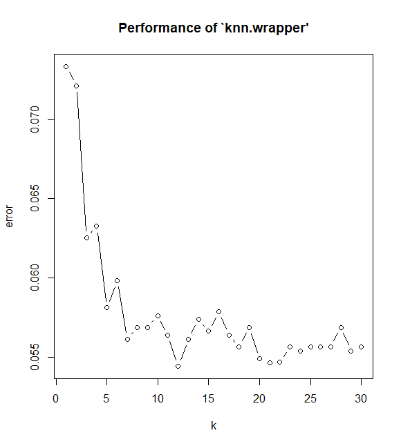

# Predicting High-Value Residential Investments Using K-Nearest Neighbors (KNN)

## Project Overview

This project explores how data analytics can help real estate investors identify homes with the potential to exceed $500,000 in value.  
Using the **West Roxbury housing dataset**, I built a **K-Nearest Neighbors (KNN)** model in R that classifies homes as either *high-value* or *standard-value*.  

The goal wasn’t just to predict property prices it was to uncover actionable insights that help investors prioritize renovation projects, focus due diligence, and make more informed acquisition decisions.

---

## Objective / Business Problem

Real estate investment firms often rely on experience, intuition, and costly appraisals to decide which properties deserve attention.  
My objective was to create a simple, data-driven model that could predict whether a home is likely to be valued above $500K based on its characteristics.  

If the model could highlight which homes are most likely to be high-value, investor could focus resources on those properties earlier thus improving efficiency and potential return on investment (ROI).

---

## Analytical Approach

I started by cleaning and preparing the dataset.  
To avoid data leakage, I removed `total.value` and `tax`, since they directly reflected property value.  
I then separated predictors from the target variable (`cat.value`), converted categorical features like `remodel` into dummy variables, and standardized all predictors to ensure that features on larger scales (like living area) didn’t overpower smaller ones.  

Once preprocessing was complete, I split the data into **70% training** and **30% testing** sets.  
I built a baseline **KNN model (K = 10)** and then fine-tuned it using **cross-validation** over a range of *k* values (1–30).  
This process identified **K = 12** as optimal for overall accuracy, but since the business goal was to **catch as many high-value homes as possible**, I also tuned the model using **recall (sensitivity)** as the key metric.  
The recall-optimized model settled on **K = 3**, which offered a better trade-off of accuracy for business use.

---

## Technical Reading

KNN is a **supervised machine learning algorithm** that predicts outcomes based on the proximity of data points.  
Because it relies on distance, scaling was essential otherwise, variables like *lot size* could dominate others such as *number of bathrooms*.  
By standardizing all numeric variables with `scale()`, each predictor contributed equally to distance calculations.

Handling categorical data required converting the `remodel` feature into dummy variables.  
This transformation allowed KNN to interpret remodel types properly, treating them as distinct categories instead of numeric ranks.

For model evaluation, I used `caret::confusionMatrix()` to compute **accuracy**, **recall**, **specificity**, and **balanced accuracy**.  
Accuracy gives a general sense of correctness, but recall is particularly valuable here — it measures how effectively the model identifies truly high-value homes.  
That metric became the driving force behind model selection.

---

## Evaluation Metrics & Results

I compared three model configurations:

| K | Accuracy | Sensitivity (Recall) | Specificity | Balanced Accuracy |
|---|-----------|----------------------|-------------|------------------|
| 10 | 0.940 | 0.676 | 0.978 | 0.827 |
| 12 | 0.941 | 0.653 | 0.983 | 0.818 |
| 03  | 0.935 | **0.708** | 0.968 | **0.838** |

While accuracy dipped slightly when optimizing for recall, the **improvement in sensitivity (0.71)** made the model more effective at catching premium-value properties — the ones that matter most to investors.  
In practice, this means fewer missed opportunities and more confident investment screening.

---

## Key Insights & Business Implications

The strongest takeaway from this project was that **remodeling status is a key driver of home value**.  
Homes with recent renovations showed a clear pattern of higher valuation — confirming that targeted remodeling is a sound investment strategy.  

From a business standpoint, this model can serve as an early-stage screening tool.  
It doesn’t replace expert judgment but complements it, allowing investor to pre-filter homes that show high potential, saving time and increasing decision accuracy.  
This kind of decision support bridges the gap between data analytics and real-world investment strategy.

---

## Skills Demonstrated / Key Takeaways

This project brought together the full data analytics workflow — from data preparation to modeling to interpretation.  

On the **technical side**, I worked extensively in **R**, using:
- `caret` for data partitioning and model evaluation  
- `dplyr` for data manipulation  
- `fastDummies` for categorical encoding  
- `class` and `e1071` for KNN implementation and tuning  

I applied **feature scaling**, **dummy encoding**, and **cross-validation** to develop and refine the model.  
Beyond the technical execution, I focused on **interpreting the results through a business lens** — understanding when to prioritize recall over accuracy and how to communicate those trade-offs effectively.  

Most importantly, I learned that successful data analysis doesn’t stop at model performance.  
It’s about translating patterns and metrics into actionable insights that help decision-makers act smarter and faster.

## Author

**Rishi Sanmitra Pillutla**  
Aspiring Data Analyst | Passion for Turning Data into Insights | Transforming Data into Business Solutions

🔗 [LinkedIn](https://www.linkedin.com/in/rishisanmitra/)  
🔗 [DataSciencePortfol.io](https://www.datascienceportfol.io/rishisanmitra12)
